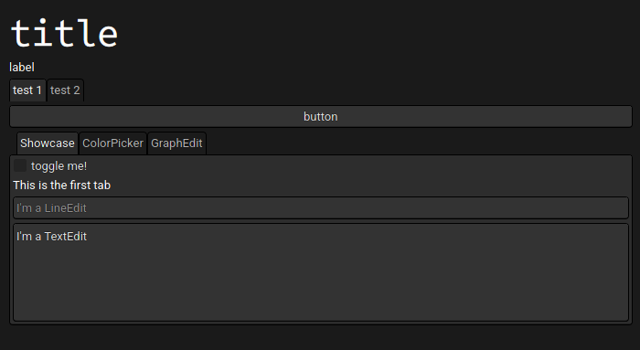
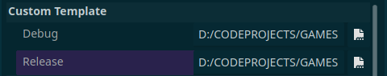

# Godot GUI App Template
This is a quickstart template to make resource-efficient and (arguably) good-looking crossplatform apps using the Godot Game Engine.  
Godot is a great and underrated way to make GUI-only apps.

## Features
- Sensible defaults for GUI apps: a custom native-looking theme with open source fonts, low processor mode, etc.
- Minified pre-built build template for resource-efficient GUI: (windows and linux only for now, you can make your own using the included custom.py following [this](https://forum.godotengine.org/t/easy-to-follow-tutorial-for-encrypting-your-pck-file/50349) guide)
- 30 MB export size using the template! 60MB avg RAM usage on Windows.

## Usage
To use this template, open up the project in the Godot Game Engine, then, in the main.tscn scene, make you UI as you wish. To export your app, go to Projects > Export and use the included MINIFIED build presets, or make your own, and make sure to select `(yourprojectfolder)/build/(windows/linux)relase(.mono).exe` as your Custom Template (hint: use .mono templates when exporting through Godot Mono):

